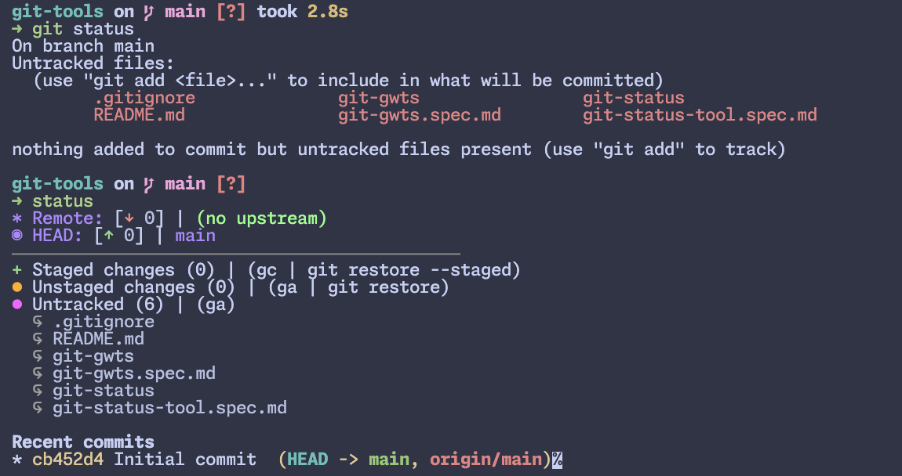

# gitstatus Tool Specification

## 1. Overview

The `gitstatus` tool provides a rich, consolidated, and highly readable status display for a Git repository. It is designed to replace or augment the standard `git status` output by leveraging visual cues, emojis, and clear textual structure to quickly convey the state of the local branch, its remote counterpart, and the working directory.

## 2. Core Features

### 2.1 Branch and Remote Status Indicator

This section provides an immediate comparison between the local branch (`HEAD`) and its tracked remote branch (`Remote`).

| Component          | Detail                                                                                                                                                              | Example        |
| :----------------- | :------------------------------------------------------------------------------------------------------------------------------------------------------------------ | :------------- | ----------------------- |
| Remote Line        | Shows the name of the tracked remote branch (for example `origin/main`, `origin/feat-demo`).                                                                        | `Remote: [↓ 0] | origin/main`            |
| Remote Pull Status | Indicates how many commits the remote has that the local branch does not. The value is shown with a down arrow. A value greater than 0 suggests running `git pull`. | `[↓ 2]`        |
| Remote Action Hint | When the remote is ahead (down arrow > 0) the action hint `(git pull)` is appended.                                                                                 | `Remote: [↓ 2] | origin/main (git pull)` |
| HEAD Line          | Shows the name of the current local branch.                                                                                                                         | `HEAD: [↑ 1]   | main`                   |
| HEAD Push Status   | Indicates how many commits the local branch has that the remote does not. The value is shown with an up arrow. A value greater than 0 suggests running `git push`.  | `[↑ 1]`        |
| HEAD Action Hint   | When the local branch is ahead (up arrow > 0) the action hint `(git push)` is appended.                                                                             | `HEAD: [↑ 1]   | main (git push)`        |

## 3. Working Directory Status

The working directory section separates changes into three categories: staged, unstaged, and untracked.

| Category         | Indicator         | State Description                                  | Example Line            |
| :--------------- | :---------------- | :------------------------------------------------- | :---------------------- | ----- | ---------------------- |
| Staged Changes   | Plus sign `+`     | Changes ready to be committed.                     | `+ Staged changes (1)   | (gc   | git restore --staged)` |
| Unstaged Changes | Orange bullet `•` | Changes made to tracked files that are not staged. | `• Unstaged changes (1) | (ga   | git restore)`          |
| Untracked Files  | Purple bullet `•` | Files in the working tree that Git does not track. | `• Untracked (1)        | (ga)` |

## 4. Color-Coding Guide

The interface uses a consistent color scheme to provide immediate visual feedback on repository, branch, and file states.

| Component                               | Color (Perceived)   | Purpose                                                                                           |
| :-------------------------------------- | :------------------ | :------------------------------------------------------------------------------------------------ |
| Current Branch Name                     | Purple              | Identifies the branch that the local HEAD currently points to (for example `main`, `feat-demo`).  |
| Remote Branch Name                      | Light green         | Identifies the upstream remote branch (for example `origin/main`).                                |
| Pending Pull Count (↓)                  | Red                 | Highlights the number of commits present on the remote but missing locally; action is `git pull`. |
| Pending Push Count (↑)                  | Green               | Highlights the number of local commits absent on the remote; action is `git push`.                |
| Commit Hashes and Messages              | Yellow or gold      | Displays recent commit metadata within the history section.                                       |
| Staged Category Title                   | Green               | Labels files that are staged and ready for commit.                                                |
| Unstaged Category Title                 | Orange              | Labels files that are modified but not staged.                                                    |
| Untracked Category Title                | Purple or magenta   | Labels files that are neither staged nor tracked by Git.                                          |
| Action Hints (for example `(git push)`) | Light gray or cyan  | Provides suggested commands to resolve the current state.                                         |
| File Names                              | White or light gray | Displays file paths in a neutral color for readability.                                           |

## 5. Commit Log History

The commit log presents a condensed, visual history that highlights the relationship between local and remote branches.

- Commit Graph: Uses characters such as `*`, `|`, `/`, and `\` to show branch lineage, merges, and divergences.
- Branch Pointers: Clearly indicates which commit corresponds to `HEAD`, `origin/<branch>`, and other relevant refs.
- Remote Commits: When pulls are pending, lists the commit hashes and messages that exist on the remote and not locally.
